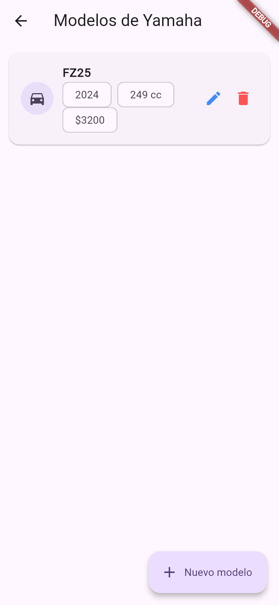
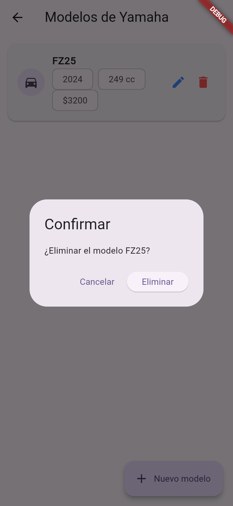

# CRUD SQLite — Motos/Autos (Maestro-Detalle)

Repositorio: https://github.com/mauuu4/flutter-sqlite.git

Aplicación Flutter que implementa un **CRUD (Crear, Leer, Actualizar, Eliminar)** usando **SQLite** como base de datos local, con una relación **maestro-detalle**:

- **Marca** (maestro): nombre y país de origen. Ej. Yamaha, Honda, Toyota.
- **Modelo** (detalle): nombre, año, cilindraje (cc) y precio, asociado a una marca.

Cada marca puede tener varios modelos. Al eliminar una marca, sus modelos se eliminan en cascada.

## ✅ Requisito cumplido

> "Subir una app Flutter que implemente un CRUD usando SQLite"

Este proyecto cumple el requisito:

- Usa el paquete [`sqflite`](https://pub.dev/packages/sqflite) (SQLite) como motor de base de datos — ver [pubspec.yaml](pubspec.yaml).
- Implementa las 4 operaciones CRUD completas para **dos** entidades relacionadas:
  - [`lib/services/marca_service.dart`](lib/services/marca_service.dart) → `createMarca`, `getMarcas`, `updateMarca`, `deleteMarca`
  - [`lib/services/modelo_service.dart`](lib/services/modelo_service.dart) → `createModelo`, `getModelosByMarca`, `updateModelo`, `deleteModelo`
- El esquema SQL (tablas, llaves foráneas, migraciones) está en [`lib/services/db_helper.dart`](lib/services/db_helper.dart).
- Funciona en **Windows/Linux/macOS** (`sqflite_common_ffi`) y en **Web** (`sqflite_common_ffi_web`), además del soporte nativo de `sqflite` en Android/iOS.

## Tecnologías

| Paquete | Uso |
|---|---|
| `sqflite` | API de acceso a SQLite (CRUD) |
| `sqflite_common_ffi` | Motor SQLite para escritorio (Windows/Linux/macOS) |
| `sqflite_common_ffi_web` | Motor SQLite (compilado a WebAssembly) para Web |
| `path` | Construcción de rutas de archivo multiplataforma |

## Estructura del proyecto

```
lib/
├── main.dart                  # Inicializa el databaseFactory según la plataforma
├── models/
│   ├── marca.dart              # Modelo Marca (maestro)
│   └── modelo.dart             # Modelo Modelo (detalle)
├── services/
│   ├── db_helper.dart          # Conexión SQLite, creación de tablas y migraciones
│   ├── marca_service.dart       # CRUD de Marca
│   └── modelo_service.dart      # CRUD de Modelo
└── pages/
    ├── marca_list.dart          # Lista de marcas (maestro)
    ├── marca_form.dart          # Crear/editar marca
    ├── modelo_list.dart         # Lista de modelos de una marca (detalle)
    └── modelo_form.dart         # Crear/editar modelo
```

## Esquema de la base de datos (SQLite)

```sql
CREATE TABLE marcas (
  id INTEGER PRIMARY KEY AUTOINCREMENT,
  nombre TEXT NOT NULL,
  pais TEXT NOT NULL DEFAULT ''
);

CREATE TABLE modelos (
  id INTEGER PRIMARY KEY AUTOINCREMENT,
  marca_id INTEGER NOT NULL,
  nombre TEXT NOT NULL,
  anio INTEGER NOT NULL,
  cilindraje INTEGER NOT NULL DEFAULT 0,
  precio REAL NOT NULL DEFAULT 0,
  FOREIGN KEY (marca_id) REFERENCES marcas (id) ON DELETE CASCADE
);
```

## Cómo ejecutar

```bash
flutter pub get
flutter run
```

Al ejecutar, Flutter te dejará elegir el dispositivo (Windows, Chrome, Edge, etc.). En **Web**, la primera vez es necesario generar los archivos de soporte de SQLite-WASM:

```bash
dart run sqflite_common_ffi_web:setup
```

## Capturas de pantalla

### 1. Lista de marcas (maestro) — operación READ
Muestra las marcas creadas (Yamaha, Honda), cada una con botones de editar y eliminar.


### 2. Crear marca — operación CREATE
Formulario para registrar una nueva marca (nombre + país de origen).


Formulario para registrar un nuevo modelo dentro de una marca.


### 3. Detalle: modelos de una marca — relación maestro-detalle
Al tocar una marca se navega a sus modelos asociados (FZ25, año, cilindraje y precio).



### 4. Editar modelo — operación UPDATE
Formulario precargado con los datos existentes del modelo para modificarlos.


### 5. Confirmación de eliminación — operación DELETE
Diálogo de confirmación antes de borrar un registro.



## Evidencia del uso de SQLite

Además del código fuente (que usa `openDatabase`, `insert`, `query`, `update`, `delete` de `sqflite`), se verificó en tiempo de ejecución (Web) que los datos se persisten mediante el motor SQLite: el navegador guarda una base de datos IndexedDB llamada `sqflite_databases` con los object stores `blocks` y `files`, que es el formato interno que usa `sqflite_common_ffi_web` para almacenar el archivo SQLite (`motos_database.db`) compilado a WebAssembly.
